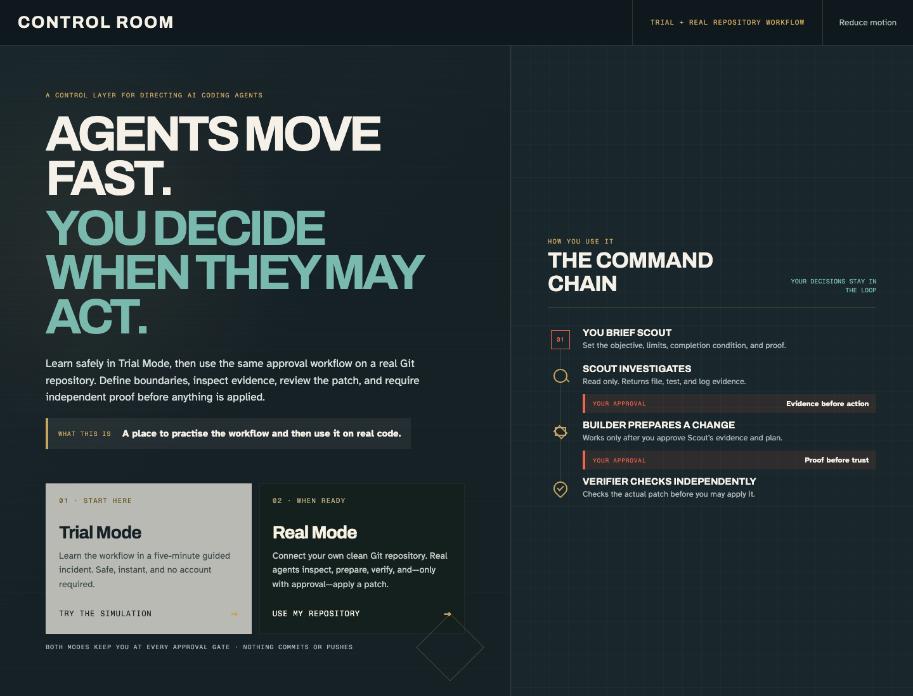
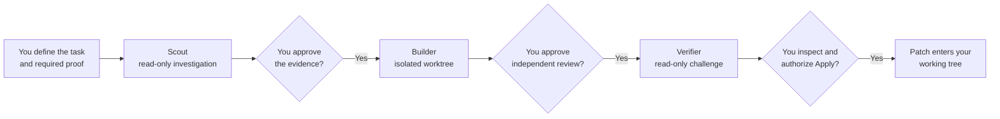

# CONTROL ROOM

> Direct AI coding agents through evidence, approval, and independent verification—then decide whether their patch reaches your working tree.

[Try Trial Mode](https://control-room-build-week-2026.pages.dev/) · [Open the public repository](https://github.com/ramenprotokol/openai-build-week-2026) · OpenAI Build Week 2026, Education track



CONTROL ROOM is a five-minute training drill and a real-repository workflow. It
teaches developers how to brief one agent, inspect its evidence, authorize a
separate agent to prepare a change, and require an independent review before
anything is applied. It never commits or pushes automatically.

## See it in one example

Imagine a developer needs to fix a retry bug. Instead of giving one agent the vague
instruction “fix it,” the developer uses CONTROL ROOM to:

1. Tell **Scout** the objective, boundaries, completion condition, and required proof.
2. Inspect Scout's file, test, and log evidence before allowing any edit.
3. Let **Builder** prepare the smallest supported patch in an isolated Git worktree.
4. Ask a separate read-only **Verifier** to challenge the actual patch.
5. Inspect the result and explicitly choose whether to apply it.

Trial Mode rehearses that workflow with a synthetic incident. Real Mode performs it
against a clean Git repository selected by the user.

## Choose a mode

| | Trial Mode | Real Mode |
|---|---|---|
| Best for | Learning the workflow | Using the workflow on a real task |
| Repository | Synthetic incident; no local files | A clean Git repository you choose |
| Agent runtime | Verified deterministic replay on the public site | Three separate Codex SDK threads using GPT-5.6 Sol |
| Changes | None | Builder writes only in a temporary detached worktree; Apply is a separate human gate |
| Account or key | None | Existing local Codex sign-in; normal plan limits apply |
| Cost from this project | None | No project API key or added paid service is required |

The optional Responses API path is separate and disabled by default. No ChatGPT
plugin, database, or hosted API key is required for either primary path.

## How it works



The user owns every consequential transition. Scout cannot edit, Builder cannot
verify itself, Verifier cannot modify the patch, and the model cannot authorize a
handoff.

## Try Trial Mode

Open the [live demo](https://control-room-build-week-2026.pages.dev/), choose
**Trial Mode**, and select **Load a strong example** if you want to start
immediately. The complete public path runs as a static replay: no account, API key,
or model call is needed.

To run the same project locally:

```bash
git clone https://github.com/ramenprotokol/openai-build-week-2026.git
cd openai-build-week-2026
npm ci
npm run dev
```

Requirements: Node.js 20 or newer and npm.

## Use Real Mode on your repository

Sign in to Codex on the machine first. Start with a clean target repository, then
run CONTROL ROOM from this project:

```bash
npm ci
npm run real -- --repo /absolute/path/to/your/git/repository
```

Open `http://127.0.0.1:4317`, choose **Real Mode**, and follow the visible gates.
After each role, CONTROL ROOM shows the model, sandbox, Codex thread ID, measured
token usage, evidence, and—when applicable—the real diff.

Real Mode:

- binds the local companion only to `127.0.0.1`;
- requires a random per-process browser token and validates local Host and Origin;
- disables agent shell-tool network access;
- pins the starting commit and refuses to continue if the repository changes;
- gives Builder write access only inside a temporary detached worktree;
- runs `git apply --check` before the final user-authorized apply; and
- never commits, pushes, deploys, or overwrites a dirty repository.

The loopback companion keeps the browser control surface local. The Codex SDK still
uses the user's Codex service and data controls, so only connect repositories that
the user is permitted to process with Codex.

### Trace export

**Download trace JSON** exports model, sandbox, timestamps, token usage, evidence
references, the repository basename, base commit, and session/thread IDs. It omits
prompts, credentials, and absolute machine paths. Review any trace before publishing
it, just as you would review a patch.

## Optional live GPT-5.6 mode

The Cloudflare Worker can run the same Trial Mode turns through the OpenAI Responses
API. Live mode is disabled in `wrangler.jsonc` and the deterministic fallback remains
the default.

After explicitly approving API spending:

```bash
cp .dev.vars.example .dev.vars
```

Edit the ignored `.dev.vars` file, provide `OPENAI_API_KEY`, set
`LIVE_AI_ENABLED` to `true`, and keep `OPENAI_MODEL` as `gpt-5.6-sol`. The key must
remain server-side; never put it in a `VITE_` variable or browser bundle. Verify the
current [GPT-5.6 Sol model page](https://developers.openai.com/api/docs/models/gpt-5.6-sol)
before enabling paid usage.

## Architecture

| Layer | Responsibility |
|---|---|
| React 19 + TypeScript | Trial and Real Mode interfaces, visible gates, evidence, diff, and trace views |
| Scenario reducer | Prevents out-of-order or model-owned transitions |
| Cloudflare Worker | Validates `POST /api/turn`, routes optional live turns, and serves the verified fallback |
| Responses API adapter | Runs bounded GPT-5.6 Sol tool loops with structured output and role-specific tools |
| Codex SDK companion | Runs Scout, Builder, and Verifier on a user-selected local repository |
| Git worktree boundary | Isolates Builder and makes final application patch-based and user-owned |

The public Pages build is a fully static replay. The optional Worker and Real Mode
companion are separate runtimes, so a reliable no-cost demo does not pretend that a
model call occurred.

## How GPT-5.6 and Codex are used

- **Codex built the project:** product design, implementation, tests, reviews,
  documentation, release checks, and the recorded build task were completed in
  Codex.
- **GPT-5.6 Sol in Trial Mode:** the optional Worker uses the Responses API,
  role-permitted tools, structured outputs, evidence allowlists, and bounded tool
  loops. The interface discloses whether each turn was live or fallback.
- **GPT-5.6 Sol in Real Mode:** the official Codex SDK starts separate Scout,
  Builder, and Verifier threads with read-only or workspace-write sandboxes. Their
  measured traces are exposed to the user.

The model can cite only evidence IDs returned by role-permitted tools. Tool content
and learner text are marked as untrusted data, and GPT-5.6 cannot approve its own
work.

## Security and privacy model

| Risk | Control | Remaining limit |
|---|---|---|
| Browser or cross-origin abuse | Same-origin Worker requests; restrictive CSP; loopback bind, random token, Host and Origin checks in Real Mode | A compromised browser or machine remains outside the app's protection |
| Agent overreach | Separate roles, sandbox permissions, no agent network, and human approval gates | Users must still inspect evidence and the final patch |
| Repository damage | Clean-tree requirement, starting-commit pin, isolated worktree, independent review, and checked patch apply | A non-failing Verifier concern can proceed only through the explicit human apply gate |
| Invented model evidence | Allowlisted tools, materialized evidence IDs, strict schemas, and deterministic fallback | The training incident is synthetic, not a production benchmark |
| Secret exposure | Server-only OpenAI key, ignored local env files, bounded requests, no stored Responses, and pre-push secret/history scans | Repository content processed by Codex follows the user's Codex data controls |
| Uncontrolled API spend | Live Worker mode disabled by default | A public live deployment still needs a Cloudflare rate limit and OpenAI project budget |

## Quality checks

```bash
npm run typecheck
npm run lint
npm run test
npm run build
npm run build:pages
npm run build:real
npm audit --audit-level=moderate
npm audit signatures
```

Tests cover the reducer, API contracts, role permissions, prompt-injection handling,
cross-origin rejection, Real Mode token/Host/Origin protection, static replay, and
the complete ordered scenario. The release build also includes keyboard focus,
live-region announcements, reduced motion, responsive layouts, and self-hosted
fonts. GitHub runs the same type, lint, test, audit, and release-build gates on Node
20 and Node 22 for every pull request and every push to `main`.

## Status and limits

This is an experimental OpenAI Build Week 2026 entry, not a general-purpose coding
agent platform.

- Trial Mode uses one synthetic enrollment incident.
- The public demo intentionally uses the verified static replay.
- Real Mode sessions live in memory and end with the local companion process.
- Live Worker mode is appropriate only after external rate and budget controls are
  configured.

## Build Week proof

- [Live demo](https://control-room-build-week-2026.pages.dev/)
- [Public repository](https://github.com/ramenprotokol/openai-build-week-2026)
- Primary Codex `/feedback` session: `019f7338-9889-7253-bb72-3bbb92cae94e`
- [Sanitized three-role GPT-5.6 trace](./evidence/live-gpt-5-6-sol-trace.json)
- [Three-role proof screenshot](./evidence/live-gpt-5-6-sol-trace.png)
- [Challenge overview](https://openai.devpost.com/) and [official rules](https://openai.devpost.com/rules)

The recorded Real Mode run used separate GPT-5.6 Sol threads for read-only Scout,
workspace-write Builder, and read-only Verifier. Verifier returned `concern` because
dependencies were unavailable inside the isolated worktree. It confirmed the
one-file boundary and disclosed the missing runtime test instead of claiming a false
pass. The main repository was not changed by the recorded patch.

## License

MIT — see [LICENSE](./LICENSE).
